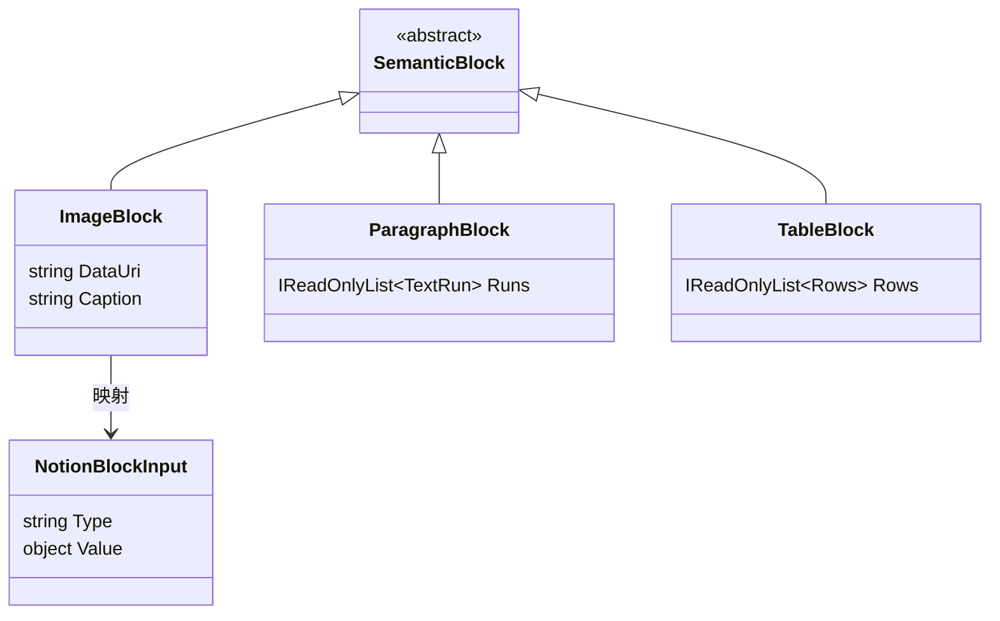

# 数据模型：图片同步功能

## 实体关系



## Schema 定义

### ImageBlock（已存在，需使用）

```csharp
/// <summary>
/// 表示 OneNote 中的图片元素
/// </summary>
public sealed record ImageBlock(string DataUri, string Caption) : SemanticBlock
{
    /// <summary>
    /// 图片的 Data URI，格式: data:image/{format};base64,{data}
    /// </summary>
    public string DataUri { get; init; }

    /// <summary>
    /// 图片标题或说明文字
    /// </summary>
    public string Caption { get; init; }
}
```

### ImageProcessingResult（新增）

```csharp
/// <summary>
/// 图片处理结果
/// </summary>
public sealed class ImageProcessingResult
{
    /// <summary>
    /// 处理后的 Data URI
    /// </summary>
    public required string DataUri { get; init; }

    /// <summary>
    /// 处理是否成功
    /// </summary>
    public required bool Success { get; init; }

    /// <summary>
    /// 错误信息（失败时）
    /// </summary>
    public string? ErrorMessage { get; init; }

    /// <summary>
    /// 原始图片大小（字节）
    /// </summary>
    public int OriginalSize { get; init; }

    /// <summary>
    /// 处理后大小（字节）
    /// </summary>
    public int FinalSize { get; init; }

    /// <summary>
    /// 原始格式（png, jpg 等）
    /// </summary>
    public string OriginalFormat { get; init; } = string.Empty;

    /// <summary>
    /// 最终格式（通常是 jpeg）
    /// </summary>
    public string FinalFormat { get; init; } = string.Empty;

    /// <summary>
    /// 压缩率 (FinalSize / OriginalSize)
    /// </summary>
    public double CompressionRatio =>
        OriginalSize > 0 ? (double)FinalSize / OriginalSize : 0;
}
```

### UnsupportedBlock（已存在，用于降级）

```csharp
/// <summary>
/// 不支持或处理失败的内容
/// </summary>
public sealed record UnsupportedBlock(string Kind, string Raw, string DegradeTo) : SemanticBlock;
```

## Notion API 格式

### Image Block Structure

```json
{
  "type": "image",
  "image": {
    "type": "file",
    "file": {
      "url": "data:image/jpeg;base64,/9j/4AAQSkZJRgABAQAA..."
    }
  }
}
```

## 数据流

```
OneNote XML
    ↓
<one:Image format="png">
  <one:Data>iVBORw0KG...</one:Data>
</one:Image>
    ↓
ImageBlock {
  DataUri: "data:image/png;base64,iVBORw0KG...",
  Caption: ""
}
    ↓
ImageProcessingResult {
  DataUri: "data:image/jpeg;base64,/9j/4AAQSkZJRg...",
  Success: true,
  OriginalSize: 6291456,
  FinalSize: 2097152,
  OriginalFormat: "png",
  FinalFormat: "jpeg"
}
    ↓
NotionBlockInput {
  Type: "image",
  Value: {
    image: {
      type: "file",
      file: { url: "data:image/jpeg;base64,..." }
    }
  }
}
```

## 常量定义

```csharp
public static class ImageProcessingConstants
{
    /// <summary>
    /// Notion API 免费版图片大小限制（字节）
    /// </summary>
    public const int NotionFreeImageSizeLimit = 5 * 1024 * 1024; // 5MB

    /// <summary>
    /// JPEG 压缩质量（0-100）
    /// </summary>
    public const int JpegQuality = 80;

    /// <summary>
    /// 每次缩图缩小的比例（0-1）
    /// </summary>
    public const double ResizeScale = 0.8;

    /// <summary>
    /// 最大缩图迭代次数
    /// </summary>
    public const int MaxResizeIterations = 10;
}
```
