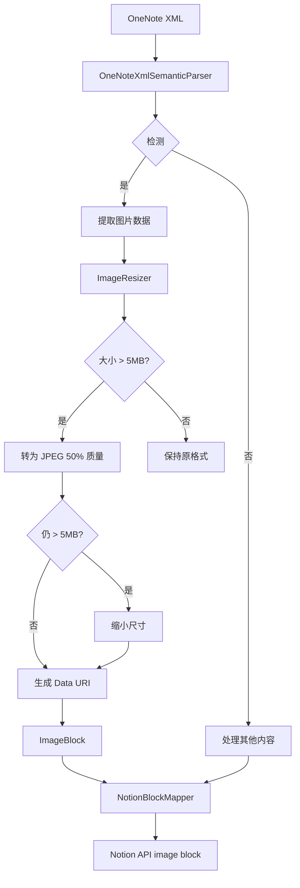

# 实现计划：图片同步支持

## 技术栈

### 依赖库
| 库 | 用途 | 版本 |
|---|------|-----|
| System.Drawing.Common | 图片处理 | 最新稳定版 |
| HtmlAgilityPack | HTML解析（已存在） | 1.11.72 |

### 为什么选择 System.Drawing.Common
- Windows 平台原生支持
- API 成熟稳定
- 支持格式转换和质量控制
- 与现有 Windows Forms 项目一致

## 架构设计

### 系统流程图



### 组件设计

#### 组件 1: OneNoteXmlSemanticParser（扩展）

**职责**: 从 OneNote XML 中解析图片元素

**接口**:
```
ParseImage(XElement imageElement) -> ImageBlock?
```

**实现细节**:
- 检测 `<one:Image>` 元素
- 提取 `format` 属性
- 提取 `<one:Data>` 中的 base64 数据
- 提取 `<one:Size>` 中的尺寸信息
- 构造 `ImageBlock`

#### 组件 2: ImageResizer（新建）

**职责**: 处理图片压缩和格式转换

**接口**:
```
ProcessImage(byte[] imageData, string format) -> ImageProcessingResult
```

**实现细节**:
- 将 base64 解码为字节数组
- 使用 System.Drawing 加载图片
- 转换为 JPEG 格式，质量 80%
- 检查大小，超过 5MB 则迭代缩小
- 返回处理后的 Data URI

**处理流程**:
```
原始图片
    ↓
解码为字节数组
    ↓
加载为 System.Drawing.Image
    ↓
保存为 JPEG (质量80%)
    ↓
检查大小
    ↓
┌─────────────┬─────────────┐
│ ≤ 5MB       │ > 5MB       │
│ 返回 DataURI│ 缩小尺寸 20% │
└─────────────┴─────────────┘
      ↓              ↓
      ←──── 返回 ←────┘
```

#### 组件 3: NotionBlockMapper（扩展）

**职责**: 将 ImageBlock 映射为 Notion API 格式

**接口**:
```
MapImageBlock(ImageBlock imageBlock) -> NotionBlockInput
```

**实现细节**:
- 添加 `case ImageBlock:` 分支
- 构造 Notion image block 结构
- 使用 Data URI 作为图片源

## 数据模型

### ImageBlock（已定义）
```csharp
public sealed record ImageBlock(string DataUri, string Caption) : SemanticBlock;
```

### ImageProcessingResult（新建）
```csharp
public sealed class ImageProcessingResult
{
    public required string DataUri { get; init; }
    public required bool Success { get; init; }
    public string? ErrorMessage { get; init; }
    public int OriginalSize { get; init; }
    public int FinalSize { get; init; }
    public string OriginalFormat { get; init; }
    public string FinalFormat { get; init; }
}
```

## 设计模式

### 模式 1: 策略模式 - 图片压缩策略
- **目的**: 支持多种压缩策略的灵活切换
- **实现**: IImageCompressionStrategy 接口
- **当前实现**: Jpeg50CompressionStrategy

### 模式 2: 责任链模式 - 图片处理流程
- **目的**: 多步处理（解码 → 转格式 → 检查大小 → 缩图）
- **实现**: 每步处理失败时传递给降级处理器

## 安全考虑

### 内存管理
- 使用 `using` 语句确保 Image 对象及时释放
- 大图片使用流式处理避免一次性加载全部

### 输入验证
- 验证 base64 数据格式
- 验证图片格式是否支持
- 处理损坏的图片数据

## 错误处理策略

| 错误类型 | 处理方式 |
|---------|---------|
| base64 解码失败 | 降级为占位符，记录错误 |
| 图片格式不支持 | 降级为占位符，记录格式 |
| 图片数据损坏 | 降级为占位符，记录警告 |
| 缩图失败 | 降级为占位符，记录错误 |

## 性能优化

### 图片处理优化
- 使用流式解码减少内存占用
- JPEG 质量设置为 50% 平衡质量和大小
- 缩图使用高质量插值算法

### 并发处理
- 图片处理在 STA 线程上顺序执行（COM 限制）
- Notion API 写入可以并发（现有架构）

## 测试策略

### 单元测试
- `ImageResizer` 各方法的单元测试
- 边界条件：正好 5MB、刚好超过、超大文件
- 各种格式：PNG、JPEG、GIF、BMP

### 集成测试
- 端到端：OneNote XML → Notion block
- 诊断日志验证

### 测试数据
- 小图片（< 1MB）
- 中等图片（1-5MB）
- 大图片（> 5MB）
- 超大图片（> 10MB）
- 损坏的图片数据
