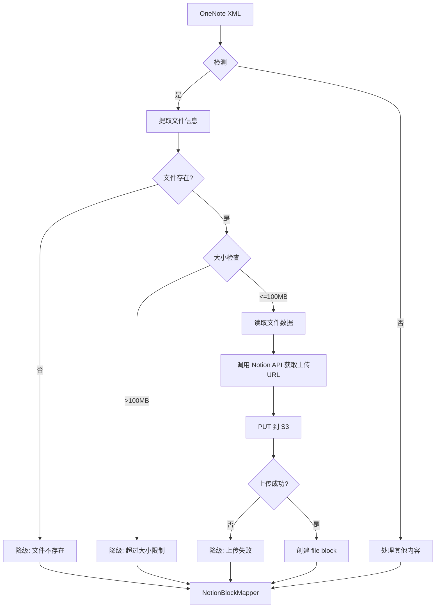

# 实现计划：附件同步支持

## 技术栈

### 依赖库
| 库 | 用途 | 状态 |
|---|---|------|
| System.Drawing.Common | 图片处理（已存在）| ✅ |
| HtmlAgilityPack | HTML解析（已存在）| ✅ |
| 无需新增 | 文件上传使用原生 HttpClient | - |

### Notion API 文档
- 上传流程：https://developers.notion.com/reference/upload-files-to-s3

## 架构设计

### 系统流程图



### 组件设计

#### 组件 1: OneNoteXmlSemanticParser（扩展）

**职责**: 从 OneNote XML 中解析附件元素

**接口**:
```csharp
ParseInsertedFile(XElement insertedFileElement) -> AttachmentBlock?
```

**实现细节**:
- 检测 `<one:InsertedFile>` 元素
- 提取 `preferredName` 属性（文件名）
- 提取 `pathCache` 属性（本地路径）
- 提取 `size` 属性（文件大小）
- 通过 `Path.GetExtension` 推断 MIME 类型
- 检查文件是否存在、是否可读

#### 组件 2: NotionApiClient（扩展）

**职责**: 处理 Notion 文件上传 API

**新增接口**:
```csharp
// 获取文件上传 URL
Task<FileUploadResponse> GetFileUploadUrlAsync(
    string fileName, 
    string token, 
    CancellationToken ct);

// 上传文件到 S3
Task<S3UploadResult> UploadToS3Async(
    string uploadUrl, 
    Dictionary<string, string> headers,
    byte[] fileData, 
    CancellationToken ct);

// 完整上传流程（组合以上两个方法）
Task<string?> UploadFileAsync(
    string fileName, 
    byte[] fileData,
    string token, 
    CancellationToken ct);
```

**实现细节**:
- 调用 `POST /v1/files` 获取上传 URL
- 构造 PUT 请求上传到 AWS S3
- 处理响应，返回 Notion 文件名
- 错误处理：网络超时、S3 返回 4xx/5xx

#### 组件 3: NotionBlockMapper（扩展）

**职责**: 将 AttachmentBlock 映射为 Notion API 格式

**新增接口**:
```csharp
MapAttachmentBlock(AttachmentBlock attachment) -> NotionBlockInput
```

**实现细节**:
- 如果 `NotionFileName` 不为空 → 构造 file block
- 如果 `ErrorMessage` 不为空 → 降级为占位符段落
- file block 结构：
  ```json
  {
    "type": "file",
    "file": {
      "type": "external",
      "name": "filename.pdf",
      "external": { "url": "https://s3..." }
    }
  }
  ```

## 与现有架构的集成

### 解析层（Parsing）
- 在 `ProcessOEChildren` 中添加 `InsertedFile` 检测
- 在表格检测之前、图片检测之后处理附件
- 返回 `AttachmentBlock` 或降级为 `UnsupportedBlock`

### 应用层（Application）
- `NotionSyncOrchestrator` 无需修改
- 现有的并发写入机制可复用

### 错误处理
- 遵循现有降级策略：失败时转为占位符文本
- 使用 `DiagnosticLogger` 记录处理日志

## 安全考虑

### 文件访问安全
- 仅读取 pathCache 指定的文件，不进行路径遍历
- 检查文件大小后再读取到内存，避免大文件导致 OOM
- 使用 `FileStream` 读取，及时释放文件句柄

### API 安全
- 仅上传用户显式授权的 Notion workspace
- Token 通过配置传递，不硬编码
- 使用 HTTPS 进行所有 API 调用

## 性能优化

### 文件读取优化
- 小文件（< 10MB）：直接读入内存
- 大文件（>= 10MB）：分块读取（如果 S3 支持）
- 使用 `FileOptions.Asynchronous` 进行异步读取

### 并发处理
- 附件解析在 STA 线程顺序执行（COM 限制）
- Notion API 上传可并发执行（复用现有架构）

## 测试策略

### 单元测试
- `NotionApiClient` 文件上传流程的 mock 测试
- `OneNoteXmlSemanticParser` 附件解析测试
- 边界条件：文件不存在、空文件、超大文件

### 集成测试
- 端到端：OneNote XML → Notion file block
- 实际文件上传测试（使用测试 token）
- 诊断日志验证

### 测试数据
- 小附件（< 1MB PDF）
- 中等附件（10-50MB）
- 大附件（> 100MB，用于测试降级）
- 不存在的文件路径
- 损坏的/无法访问的文件
